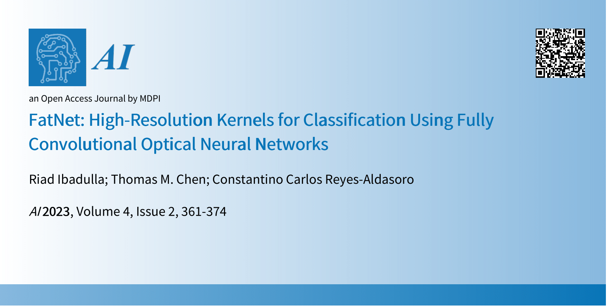

[](https://www.mdpi.com/2673-2688/4/2/18)


# Optical Neural Network simulator and FatNet

This repository contains the library, which serves as the simulator of the 4f free-space system. It 
uses the custom convolutional layer in PyTorch, which uses the simulation of the light 
propagation in the 4F device.

4f system, is an optical system containing the laser, light modulators, a pair of lenses and the camera.
This system can accelerate the speed of inference of the convolution operation compared to the traditional
on GPU convolution. 

FatNet is the type of the neural network transformation, which can potentially make the classifier convolutional
neural network more compatible with the free-space optics. The description of FatNet can be found in the paper
described in the "Paper" section.

### Install using pip ###
```commandline
pip install optnn
```
[Link to PyPI](https://pypi.org/project/optnn/)

### How to Run ###

#### Simulation of 4f system ####
If using PyTorch, the layer can be used in the similar way as the standrd Conv2D. It has to be imported as: 
```Python
from optnn import OpticalConv2d
```

Optical convolutional layer structure is:

```Python
OpticalConv2d(input_channels, output_channels, kernel_size, is_bias=True, pseudo_negativity=False, input_size=28, noise=True)
```
PS: if input_size of the layer has to be passed, the default value for input is **28x28**. 

#### Examples and FatNet ####
To run the example models and FatNet described in the paper use the command below by running the MAIN.py file:

```commandline
python3 MAIN.py --batchsize=(your batch size here) --model (model name) --epochs=(number of epochs)
```

The models you can use are:
* RESNET
* FATNET
* OPTICALFATNET

PS: Optical Fatnet is the only model that will use the simulator

### Paper ###
<a href ="https://www.mdpi.com/2673-2688/4/2/18"></a>
<a href="https://www.mdpi.com/2673-2688/4/2/18">**Title: FatNet: High Resolution Kernels for Classification Using Fully Convolutional Optical Neural Networks**</a>

Authors: Riad Ibadulla, Thomas M. Chen and Constantino Carlos Reyes-Aldasoro

Correspondence: riad.ibadulla@city.ac.uk


